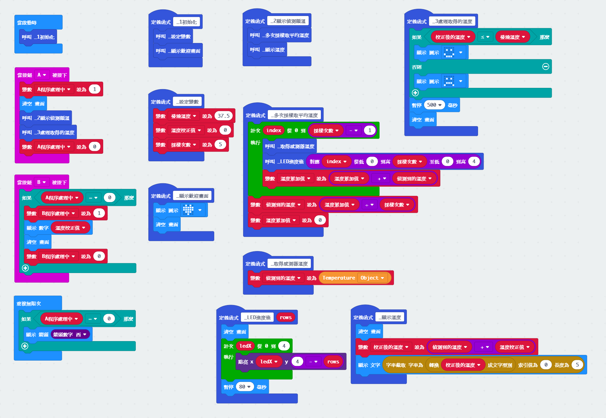
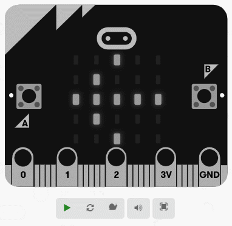

# BBC Micro:bit + MLX90614 Forehead Thermometer

## Project Info

* v1 is a simulator, not really using MLX90614 module.
* v2 is the final version using MLX90614 module.
	* URL: https://makecode.microbit.org/_UJgXmjeR5cVi

## How to connect

|microbit pin |MLX90614 pin|
|:-----------:|:-----------|
|   P20       |   SDA      |
|   P19       |   SCL      |
|   GND       |   GND      |
|   3V        |   PWR/VIN  |

## How to program

1.add extension `https://github.com/DoraLC/pxt-MLX90614` on makecode editor.

2.copy the whole code from `makecode.js` and paste on makecode editor (switch to javascript editor).

Here is the code blocks:

You can also download the `microbit-mlx90614.hex` to your micro:bit directly.

## Demo

~ END ~
